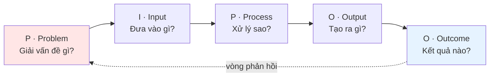

# Khung tư duy PIPOO

## 1) Định nghĩa ngắn
**PIPOO** mở rộng mô hình kinh điển **IPO (Input – Process – Output)** bằng cách thêm một chữ ở đầu và một chữ ở cuối:

**Problem → Input → Process → Output → Outcome**

Và điểm mấu chốt: **PIPOO không phải đường thẳng mà là một vòng lặp** — chữ **Outcome** ở cuối quay ngược về chữ **Problem** đầu tiên của vòng kế.

Trong vault này, PIPOO vừa là **lăng kính tư duy hệ thống**, vừa là **phương pháp vận hành**: dùng AI Agent biến nguồn tri thức đáng tin thành một wiki cá nhân truy vấn được, nhằm giải quyết vấn đề thực tế trong giới hạn nguồn lực của người học.

PIPOO không bắt đầu từ câu hỏi "mình muốn học/làm gì?", mà từ: **vấn đề nào đáng để mình dùng thời gian, sức khỏe, sự chú ý và năng lực để giải quyết?** — và kết thúc bằng: **kết quả tạo ra có thật sự thay đổi điều gì đáng giá không?**

> Note này là bản rút gọn để dùng hằng ngày: đi từ năm chữ PIPOO → vòng lặp → phân biệt Output ≠ Outcome → cách giao việc cho AI. Khung này tổng hợp từ tư duy hệ thống kinh điển (Forrester, Meadows, Argyris) và áp 4 tầng: tế bào → não người → LLM → người + AI.

## 2) Năm chữ của PIPOO

| Chữ | Tên | Câu hỏi nó buộc bạn hỏi |
|---|---|---|
| **P** | **Problem** (Vấn đề) | Ta đang thật sự giải bài toán gì? Vì cái gì? |
| **I** | **Input** (Đầu vào) | Ta đưa vào những gì — dữ liệu, bối cảnh, nguồn lực? |
| **P** | **Process** (Xử lý) | Quá trình biến đầu vào thành đầu ra diễn ra thế nào? |
| **O** | **Output** (Đầu ra) | Ta tạo ra cái gì cụ thể? |
| **O** | **Outcome** (Kết quả thật) | Cái đó có tạo ra thay đổi đáng giá không? |

Ba chữ giữa — **I-P-O** — là phần "ai cũng làm": đưa vào, xử lý, lấy ra. Nhưng **hai chữ rìa** (Problem và Outcome) mới là phần làm nên giá trị của khung này — và cũng là hai đầu người làm việc cùng AI dễ bỏ quên nhất.

## 3) PIPOO là một vòng lặp (single-loop vs double-loop)
Chữ **Outcome** không phải đích đến. Nó **quay ngược trở lại** làm đầu vào cho chữ **Problem** của vòng kế tiếp — đúng định nghĩa vòng phản hồi thông tin của Jay Forrester (*System Dynamics*) và Donella Meadows (*Thinking in Systems*).

- **Single-loop:** sửa cách *làm* (Input, Process) để đạt mục tiêu cũ.
- **Double-loop:** dừng lại hỏi *"mục tiêu này có còn đáng theo đuổi không?"* — sửa luôn giả định nền (Chris Argyris).

Đó là lý do Outcome phải quay về **Problem**, chứ không chỉ quay về Input. Sửa Input là single-loop; hỏi lại "ta có đang giải đúng bài toán không" là double-loop.

Ví dụ kinh điển là **bộ điều nhiệt (thermostat)**: đo nhiệt độ thực tế (output) → so với mục tiêu → bật/tắt sưởi (điều chỉnh) → lặp lại. Ba thành phần *mục tiêu · đo độ lệch · phản ứng* chính là chữ **P**, chữ **Outcome**, và vòng lặp khép kín của PIPOO.

## 4) Trái tim của khung: Output ≠ Outcome
- **Output** là thứ bạn **tạo ra**: bài viết, note, đoạn code, tính năng.
- **Outcome** là **sự thay đổi hành vi/giá trị** mà thứ đó gây ra (Josh Seiden: *"một outcome là một thay đổi trong hành vi con người tạo ra kết quả"*).

Lẫn hai cái này dẫn tới **vanity metrics** (Eric Ries) — những con số làm bạn thấy sướng nhưng không giúp ra quyết định: tổng note đã viết, tổng prompt đã chạy. Đối lập là **actionable metrics** — gắn trực tiếp với một quyết định.

**Problem và Outcome phải soi gương nhau:** điều bạn đo ở cuối (Outcome) phải trả lời đúng cho bài toán bạn đặt ở đầu (Problem). Nếu không khớp, đâu đó trong vòng lặp đã gãy.

AI làm việc tạo *output* trở nên rẻ và nhanh gấp bội → vanity metrics phình to chóng mặt trong khi outcome thật vẫn đứng yên. Công cụ càng mạnh, chi phí của việc **đặt sai Problem** và **đo sai Outcome** càng lớn.

## 5) Hai lỗi hệ thống PIPOO chống lại
AI đang khuếch đại cả hai lỗi này:

- **Lỗi 1 — Nhảy vào công cụ trước khi hiểu vấn đề.** "Khách hàng không muốn mũi khoan 1/4 inch, họ muốn cái lỗ 1/4 inch" (Theodore Levitt / Jobs-to-Be-Done). Áp vào AI: ta lao vào đánh bóng prompt, sinh thêm bản nháp, trong khi cái lỗ chưa được khoan — tối ưu **giải pháp** trước khi định nghĩa rõ **nhu cầu**.
- **Lỗi 2 — Đo output thay vì outcome.** Định luật Goodhart: *"khi một thước đo trở thành mục tiêu, nó thôi là một thước đo tốt."* Ví dụ kinh điển xảy ra ngay tại Hà Nội thời Pháp: treo thưởng theo **đuôi chuột** → dân cắt đuôi rồi thả chuột ra cho sinh sản tiếp; số chuột tăng. Thước đo thay thế mục tiêu thật.

Hai lỗi có chung mẫu số: **lỗi ở hai đầu của chuỗi** — đầu vào sai mục đích, đầu ra sai thước đo. Đó chính xác là hai đầu PIPOO buộc bạn nhìn.

## 6) Tuyên ngôn PIPOO
- **Vấn đề trước tiên.** Không học/làm vì tri thức hấp dẫn, mà vì có vấn đề đáng giải quyết.
- **Nguồn lực cá nhân là ràng buộc thiết kế.** Thời gian, sức khỏe, tiền bạc, sự chú ý, trí nhớ và năng lực học đều có giới hạn.
- **Chọn vấn đề có giá trị thực tế.** Ưu tiên vấn đề của doanh nghiệp hiện tại, doanh nghiệp muốn tham gia, hoặc thị trường muốn phục vụ.
- **Chọn lĩnh vực có thể học sâu.** Vấn đề đáng theo đuổi cần vừa có nhu cầu thật, vừa nằm trong vùng mình tích lũy được năng lực.
- **Tri thức phải quay về hành động.** Đọc, nghe, xem, lưu và hỏi sâu chỉ có giá trị khi giúp tạo quyết định, dự án, sản phẩm tri thức hoặc năng lực tốt hơn.
- **Đo Outcome, không chỉ đếm Output.** Một việc chỉ xong khi nó tạo ra thay đổi đáng giá, không phải khi đã có sản phẩm để khoe.

## 7) PIPOO giải quyết vấn đề gì?
- Tri thức quá nhiều, nhưng người học không biết nên học gì trước.
- Lưu nhiều bài báo, video, paper, PDF nhưng không biến thành hiểu biết dùng được.
- Vault phình to vì nhiều input nhưng thiếu Problem, Process, Output và Outcome.
- Bận rộn tạo ra nhiều output (đặc biệt nhờ AI) nhưng không chắc có thay đổi gì thật.
- Hỏi LLM chung dễ gặp câu trả lời bịa, thiếu nguồn hoặc không khớp bối cảnh cá nhân.
- Phương pháp ghi chú thủ công đòi hỏi tự viết, tự highlight, tự link quá nhiều nên khó duy trì.

## 8) Nguyên lý cốt lõi
1. **Problem First** — Gọi tên vấn đề trước khi thu nạp thêm tài liệu.
2. **Outcome Last (và đóng vòng)** — Mỗi việc kết thúc bằng câu hỏi "kết quả có thật sự dịch chuyển điều gì không?"; kết quả vòng này định nghĩa lại vấn đề vòng sau.
3. **Nguồn gốc là bất biến** — Source thô giữ trong `1.CAPTURE`, không xóa, không chỉnh sửa tùy tiện.
4. **Đầu vào phải được ingest** — Tri thức chỉ vào `2.INPUT` khi đã thành note có cấu trúc, có source, có khả năng dùng lại.
5. **Agent bảo trì, người dùng đào sâu** — Agent ingest, chuẩn hóa template, routing, nối link, giữ trật tự; người dùng chọn vấn đề, đưa tri thức vào, đọc lại, hỏi sâu và **đánh giá outcome**.
6. **Hỏi vault trước khi hỏi mô hình chung** — Ưu tiên hỏi trên vault, source gốc và kho đã nạp (NotebookLM) trước.
7. **Output chứng minh việc học — Outcome chứng minh việc học có ích** — Nếu tri thức không giúp giải quyết vấn đề hoặc cải thiện quyết định, cần xem lại cách học và cách ingest.

## 9) Vai trò của người dùng và AI Agent
PIPOO không đặt gánh nặng bảo trì tri thức hoàn toàn lên người dùng. Trong thời đại quá tải thông tin, việc tự tay ghi, highlight, chỉnh từng note và tự nối link cho mọi thứ rất dễ đứt gãy vì quá tốn thời gian.

Khi một con người và một AI cùng làm việc, ta có một **hệ nhận thức lai (joint cognitive system)** — và PIPOO chỉ rõ ai giữ chữ nào:

- **P · Problem — con người đặt:** AI không tự biết điều gì đáng giải nếu không ai nêu mục tiêu.
- **I · Input — con người cung cấp:** link YouTube, bài báo, paper, PDF, ảnh, ghi chú thô, quan sát, câu hỏi, ràng buộc.
- **P · Process — chia đôi:** Agent lo tính toán/ngôn ngữ/ingest; con người lo phán xét, kiểm tra, định hướng giữa chừng.
- **O · Output — máy tạo ra:** note có cấu trúc, bản nháp, phân tích, đoạn code.
- **O · Outcome — con người đánh giá:** cái máy tạo ra có thật sự thay đổi điều gì đáng giá trong việc học/làm/quyết định không.

Điểm khác biệt: **hiểu sâu không nhất thiết đến từ việc tự tay viết lại mọi note; hiểu sâu đến từ việc có note đủ tốt để đọc, hỏi, kiểm chứng, áp dụng — rồi đánh giá kết quả thật.**

## 10) Vault là nguồn hỏi trước
Một mục tiêu quan trọng của PIPOO là biến vault thành wiki cá nhân và knowledge base đáng tin. Người dùng đưa tri thức từ nguồn đáng tin vào trước: sách, paper, bài báo, tài liệu chuyên môn, video, ghi chú quan sát, tài liệu nội bộ hoặc nguồn đã kiểm chứng.

Khi đó, Agent trả lời dựa trên:

- Note đã ingest trong vault.
- Source gốc giữ trong `1.CAPTURE`.
- Link giữa các note trong knowledge graph.
- NotebookLM hoặc kho tri thức ngoài đã nạp nhiều sách, tài liệu, paper.
- Các môi trường làm việc như Obsidian Agent, Claude Code, Antigravity hoặc Codex khi cần hỏi sâu, tổng hợp hoặc áp dụng.

Nguyên tắc: **ưu tiên truy vấn nguồn đã chọn và đã lưu trong hệ thống của mình trước; dùng LLM như lớp suy luận, tổng hợp và đối thoại, không xem LLM chung là nguồn sự thật chính.**

## 11) Luồng vận hành
1. **Đặt Problem** — Gọi tên vấn đề/nhiệm vụ và outcome mong muốn (hành vi nào thay đổi) trước khi thu nạp.
2. **Thu nạp nguồn (Input)** — Thêm link YouTube, bài báo, paper, PDF, ảnh, ghi chú thô, clipping, ý tưởng nhanh vào Obsidian.
3. **Ingest bằng Agent (Process)** — Agent đọc nguồn thô, chọn template phù hợp, viết lại thành note có cấu trúc, thêm frontmatter, gắn source, routing đúng folder.
4. **Bảo toàn source gốc** — Source gốc được move sang `1.CAPTURE`.
5. **Tạo Output** — Note đã ingest, bài viết, framework, deck… được đưa vào folder đúng vai trò.
6. **Đào sâu và áp dụng** — Người dùng đọc, hỏi 5W1H, liên hệ Problem, đưa vào project hoặc output.
7. **Đo Outcome và đóng vòng** — Sau một khoảng thời gian, đánh giá kết quả thật; dùng kết quả đó định nghĩa lại Problem cho vòng sau (double-loop).
8. **Review và archive** — Khi vấn đề đã giải hoặc note không còn hoạt động, cập nhật trạng thái và lưu trữ.

## 12) Cấu trúc folder và routing

| Folder | Vai trò trong PIPOO | Route vào khi |
|---|---|---|
| `1.CAPTURE` | Source gốc thô | Link, PDF, ảnh, clipping, ghi chú thô, paper gốc, bài báo gốc |
| `2.INPUT` | Tri thức đã ingest | Note đã có template, source, link và khả năng tái dùng |
| `3.PROCESS` | Nơi xử lý và triển khai | Dự án đang làm, bài viết nháp, quá trình chắt lọc thành sản phẩm |
| `4.OUTPUT` | Sản phẩm tri thức | Bài viết, framework, synthesis, deck, essay, checklist đã hoàn chỉnh |
| `5.RESOURCE` | Tài nguyên vận hành vault | Template, attachment, asset phụ trợ |
| `6.PROBLEM HUB` | Vấn đề cần giải quyết | Problem, symptom, câu hỏi mở, vấn đề đã giải |
| `7.ARCHIVES` | Lưu trữ | Dự án đã xong, nội dung không còn active |
| `8.TRACK` | Theo dõi vận hành | Task, daily note, meeting, log theo dõi |

Nếu phân vân, hỏi theo thứ tự:

1. Đây là source gốc hay note đã xử lý?
2. Nó đang phục vụ vấn đề (Problem) nào?
3. Nó là tri thức tham khảo, công việc đang làm hay output đã hoàn chỉnh?
4. Nó cần theo dõi hằng ngày hay lưu trữ dài hạn?

## 13) Artifact của từng tầng

| Tầng | Artifact chính | Dấu hiệu hoàn thành |
|---|---|---|
| Problem | Problem note, symptom note, problem hub | Vấn đề được gọi tên, có bối cảnh, có câu hỏi cần giải |
| Input | Concept note, method note, principle note, tool note, summary note | Có source, viết lại bằng lời mình, có link liên quan |
| Process | Project note, working note, outline, draft, synthesis đang phát triển | Có mục tiêu, bước tiếp theo, vật liệu tri thức đang dùng |
| Output | Article, essay, framework, deck, checklist, decision memo | Có audience, luận điểm rõ, đủ hoàn chỉnh để dùng/chia sẻ |
| Outcome | Ghi chú đánh giá kết quả, metric thực tế, bài học rút ra | Có bằng chứng thay đổi hành vi/giá trị; Problem vòng sau được định nghĩa lại |
| Track | Daily note, meeting note, task log | Theo dõi được việc đã làm, việc tiếp theo và nhịp vận hành |
| Archive | Archived project, archived output, old version | Không còn active nhưng còn giá trị truy vết |

## 14) Giao việc cho AI theo PIPOO
Dùng PIPOO như một checklist mỗi lần giao việc cho AI — đặc biệt hữu ích cho chủ doanh nghiệp và người làm chuyên môn không phải dân kỹ thuật.

**Ví dụ thật: "Nhờ AI viết bài giới thiệu sản phẩm sofa mới."**

| Bước | Cách làm SAI (bỏ qua P & Outcome) | Cách làm ĐÚNG (đủ PIPOO) |
|---|---|---|
| **P · Problem** | "Viết bài giới thiệu sofa" | "Khách xem trang sofa nhưng không nhắn tin — cần bài *làm họ tin chất lượng bọc may đo* để chủ động hỏi giá" |
| **I · Input** | Tên sản phẩm | Ảnh chi tiết đường may, chất liệu, 3 phản hồi khách cũ, mức giá, chân dung khách mục tiêu |
| **P · Process** | "Viết hay vào" | Yêu cầu AI suy luận từng bước: nêu nỗi lo của khách → đối chiếu chi tiết sản phẩm → chốt bằng lời mời hỏi giá |
| **O · Output** | 1 đoạn văn | 1 bài + 3 tiêu đề + 1 CTA, đúng giọng thương hiệu |
| **O · Outcome** | (không đo) | Sau 1 tuần: số tin nhắn hỏi giá từ trang đó **có tăng không?** |

Khác biệt nằm ở hai đầu: người dùng AI nghiệp dư bắt đầu ở chữ I ("viết cho tôi cái…") và dừng ở Output ("xong rồi, có bài đây"). Người dùng giỏi bắt đầu sớm hơn một bước (Problem) và kết thúc muộn hơn một bước (Outcome).

**Ba câu hỏi bỏ túi cho mỗi lần giao việc cho AI:**

1. *Trước khi gõ prompt:* "Outcome thật tôi muốn là **hành vi nào** của ai thay đổi?" (không phải "tôi muốn AI tạo ra cái gì")
2. *Khi viết prompt:* "Tôi đã cho AI đủ Input và yêu cầu nó trình bày Process chưa, hay chỉ ra lệnh trống?"
3. *Sau khi có kết quả:* "Output này có thật sự dịch chuyển Outcome không — hay chỉ là một vanity metric đẹp mắt?"

Và quan trọng nhất — **đóng vòng lặp**: kết quả thật vòng này trở thành thông tin định nghĩa lại Problem vòng sau. Đó là double-loop learning trong thực hành.

## 15) PIPOO có đang hoạt động không?
- Source trong `1.CAPTURE` được ingest thành note dùng được.
- Note trong `2.INPUT` có source, link và cấu trúc dễ đọc.
- Problem trong `6.PROBLEM HUB` được làm rõ hoặc giải quyết.
- Project trong `3.PROCESS` có next action rõ.
- Output trong `4.OUTPUT` được tạo từ tri thức đã ingest.
- **Có đo Outcome:** mỗi việc lớn đều có câu hỏi "kết quả thật là gì" và bằng chứng kèm theo, không chỉ "đã làm xong".
- Câu hỏi quan trọng được trả lời bằng vault/source/NotebookLM trước khi hỏi LLM chung.
- Người dùng có câu hỏi 5W1H hoặc follow-up để đào sâu note quan trọng.
- Insight được áp dụng vào dự án, công việc hoặc quyết định thật.
- Người dùng cảm thấy giảm tải khi học, viết hoặc ra quyết định.

## 16) Vòng review

### Hằng ngày
- Dọn nhanh daily note và task trong `8.TRACK`.
- Chuyển ý đáng giữ thành capture hoặc note xử lý.
- Gắn vấn đề nếu một ý tưởng liên quan đến problem đang mở.

### Hằng tuần
- Kiểm tra source mới trong `1.CAPTURE` đã ingest chưa.
- Kiểm tra note mới trong `2.INPUT` có link và source chưa.
- Kiểm tra `6.PROBLEM HUB`: vấn đề nào đang mở, vấn đề nào đã có tiến triển.
- Kiểm tra `3.PROCESS`: dự án nào cần next action, dự án nào nên archive.

### Hằng tháng
- Đánh giá output đã tạo trong `4.OUTPUT` — và quan trọng hơn, **outcome thật** chúng tạo ra.
- Archive dự án hoàn thành sang `7.ARCHIVES`.
- Dọn template/attachment trong `5.RESOURCE`.
- Kiểm tra note mồ côi, note thiếu source, note không còn dùng.

## 17) PIPOO khác gì PDCA, OODA, DMAIC? (và khi nào KHÔNG nên dùng)

| Chu trình | Khởi đầu từ | Tách Output ≠ Outcome? | Có vòng lặp? |
|---|---|---|---|
| **PDCA** (Deming) | Plan | Không rõ | Có |
| **OODA** (Boyd) | Observe | Không | Có |
| **DMAIC** (Six Sigma) | Define ✅ | Một phần | Có |
| **IPO / SIPOC** | Input | Không | Không |
| **PIPOO** | Problem ✅ | Có, rõ ràng ✅ | Có ✅ |

PIPOO không phải phát minh từ hư không, cũng không thay thế các khung trên. Giá trị của nó là **đóng gói lại một số nguyên lý hệ thống cốt lõi thành một lăng kính bỏ túi** đủ nhỏ để dùng hằng ngày — trong một prompt, một cuộc họp, một quyết định.

**Khi nào KHÔNG nên dùng PIPOO:**

- **Việc phản xạ tốc độ cao** (xử lý sự cố trong vài giây) → nhường cho **OODA**.
- **Cải tiến quy trình cần bằng chứng thống kê** (giảm tỉ lệ lỗi từ 3% → 0.5%) → dùng **DMAIC** đầy đủ.
- **Nghiên cứu khám phá khi chính chữ P còn chưa biết** → ép Problem-first quá sớm sẽ đóng khung sai; cần giai đoạn khám phá mở trước.

PIPOO mạnh nhất ở vùng giữa: quyết định và công việc tri thức hằng ngày, nơi bạn đủ thông tin để đóng khung vấn đề nhưng hay quên làm — đặc biệt khi đang giao việc cho AI.

## 18) Quan hệ với CODE, PARA và Zettelkasten
PIPOO không dùng nguyên xi [[code-method-tiago-forte]], [[para-framework]] hay [[zettelkasten-co-ban]]. Nó vay mượn có chọn lọc:

- Từ CODE: tư duy tri thức cần đi từ thu nạp đến output.
- Từ PARA: tư duy tổ chức theo trạng thái sử dụng và khả năng hành động.
- Từ Zettelkasten: tư duy viết lại, chia nhỏ, liên kết và phát triển tri thức.

Nói ngắn gọn: **CODE là cảm hứng quy trình, PARA là cảm hứng tổ chức, Zettelkasten là cảm hứng cấu trúc note; PIPOO là hệ thống vận hành thực tế của vault này** — và nó thêm hai chữ các khung kia không nhấn: chữ **Problem** ở đầu và chữ **Outcome** + vòng lặp ở cuối.

## 19) Khi nào phù hợp / không phù hợp
Phù hợp khi:

- Bạn học/làm để giải quyết vấn đề thực tế.
- Bạn đọc/nghe/xem nhiều và cần hệ thống biến input thành output có ích.
- Bạn dùng Obsidian Agent để ingest, route và bảo trì note.
- Bạn muốn kết hợp quản lý tri thức, quản lý vấn đề và tạo sản phẩm tri thức.
- Bạn không duy trì nổi phương pháp ghi chú thủ công vì quá mất thời gian.
- Bạn muốn có knowledge base riêng từ nguồn đáng tin để hỏi sâu bằng Agent.

Không phù hợp hoặc cần điều chỉnh khi:

- Bạn đọc hoàn toàn để thư giãn, không cần output.
- Bạn đang khám phá tự do và chưa muốn đóng khung problem.
- Bạn làm nghiên cứu học thuật yêu cầu citation, versioning và kiểm chứng nghiêm ngặt hơn.
- Bạn cần cộng tác nhóm real-time nhiều hơn là quản lý vault cá nhân.

## 20) Lỗi thường gặp
- **Đưa source thô thẳng vào `2.INPUT`.** Giữ source gốc trong `1.CAPTURE`; chỉ đưa note đã ingest vào `2.INPUT`.
- **Học và lưu nhiều nhưng không gắn với Problem.** Tạo hoặc link vấn đề trong `6.PROBLEM HUB`.
- **Đếm Output thay vì đo Outcome.** Tạo nhiều bài/note rồi coi là xong, không hỏi nó thay đổi được gì thật — đúng cái bẫy vanity metric.
- **Lẫn lộn project đang làm với output đã hoàn thành.** `3.PROCESS` cho quá trình đang làm, `4.OUTPUT` cho artifact đã đúc kết.
- **Dùng `5.RESOURCE` như nơi chứa tri thức.** Chỉ dùng cho template, attachment, tài nguyên phụ trợ.
- **Giao hết cho Agent nhưng không đọc, không hỏi, không áp dụng.** Sau khi ingest, chọn note quan trọng để đọc lại, hỏi 5W1H và đưa vào project hoặc problem cụ thể.
- **Cố tự viết lại mọi note như phương pháp thủ công cũ.** Để Agent xử lý cấu trúc và bảo trì; chỉ tự ghi lại insight thật sự quan trọng.
- **Hỏi LLM chung trước khi kiểm tra vault/source.** Ưu tiên hỏi Agent trên vault, source gốc hoặc NotebookLM trước.

## 21) Ví dụ áp dụng
Tình huống: Bạn đọc một paper về cách giảm tải nhận thức khi học.

- **Problem:** "Tôi học nhiều nhưng dễ quên và khó biến thành bài viết."
- **Input:** thêm paper/PDF vào Obsidian, dùng Agent ingest thành note có cấu trúc.
- **Source gốc:** move PDF/clipping ban đầu vào `1.CAPTURE`.
- **Process:** nếu dùng note đó để viết bài, quá trình viết nằm trong `3.PROCESS`.
- **Output:** bài viết hoàn chỉnh lưu trong `4.OUTPUT`.
- **Outcome:** sau 2 tuần áp dụng, bạn có nhớ và dùng được kỹ thuật giảm tải đó khi học thật không? Bài viết có ai đọc/đổi cách học không? → ghi lại bằng chứng.
- **Đóng vòng:** nếu Outcome cho thấy "viết xong nhưng vẫn quên", Problem vòng sau không phải *viết thêm bài* mà là *thiết kế cách ôn tập theo spacing*.
- **Track:** task viết bài và daily note theo dõi tiến độ nằm trong `8.TRACK`.
- **Archive:** sau khi hoàn thành, project viết bài đưa vào `7.ARCHIVES`.

## Liên kết
- [[so-sanh-pipoo-code-para-zettelkasten]]
- [[code-method-tiago-forte]]
- [[para-framework]]
- [[zettelkasten-co-ban]]
- [[flow-phuong-phap-pkm-obsidian]]
- [[review-va-bao-tri-vault]]
